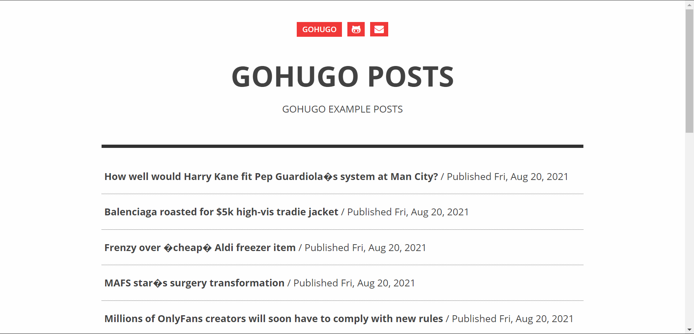

# GoHugo News

> This is GoHugo blog post project example

This is fast cause built with GoHugo and using ghostwriter as UI template

## Built With

- GoHugo
- Blog post is generated from https://api.currentsapi.services/v1/

## Live Demo

- [Live Preview](https://611f5cb1df8dc80dd110cfc8--adoring-beaver-cce974.netlify.app/)

## Getting Started

**Do this steps to reproduce this API to your own computer.**

To get a local copy up and running follow these simple example steps.

### Prerequisites

- hugo
- git

### Setup

`git clone https://github.com/Mfdsix/GoHugo-Blog-Example <project-name>`

### Usage

`hugo serve`

### Run test

`visit localhost:1313`

### Deployment

I use netlify to deploy this project, you can find guide from hugo official documentation [here](https://gohugo.io/hosting-and-deployment/hosting-on-netlify)

### Post Automator Usage

you can run post automator to create some page automatically. In this example i got posts from this api https://api.currentsapi.services/v1/. You can use same api but you should generate your own token first. You can also get posts from other posts api provider with some adjustment on automator.py file.

## Authors

👤 **Mfdsix**

- GitHub: [@Mfdsix](https://github.com/Mfdsix)

## 🤝 Contributing

Contributions, issues, and feature requests are welcome!

Feel free to check the [issues page](../../issues/).

## Show your support

Give a ⭐️ if you like this project!

## 📝 License

This project is [Apache](https://www.apache.org/licenses/LICENSE-2.0) licensed.
